# Title and Description
## DOG SANITIZATION(PawClean)

PawClean is a go-to solution which ensure the well being of your furry friends.With this app you can request for the vaccination of your furry friend.This app provides user friendly interface so that even the novice can use the functionality at ease of cost.
It has a special feature(Emergency SOS) which enables to send the live location of furry friend met with some incident to the local concerning body.It makes easy to maintain a sanitary environment for your beloved furry friend,thus promoting overall happiness.

--------------------------------------------------------------------------------
# Installation

## 1.Download:

->First download PawClean apk.

## 2.Setup:

->Open the app after installation.

->Follow on-screen instructions.

## 3.Permission:

->Grant Location permission for the app to access the feature.

## 4.Start Using

->Navigate through app features to schedule and manage dog sanitization task effectively.

----------------------------------------------------------------------------------   
# Usage
-----------------------------------------------------------------------------------
->Detail about how users can interact with the app

->Include examples and scenarios to illustrate typical use cases.

-------------------------------------------------------------------------------------
# Code Structure
--------------------------------------------------------------------------------------
## Slidder-1
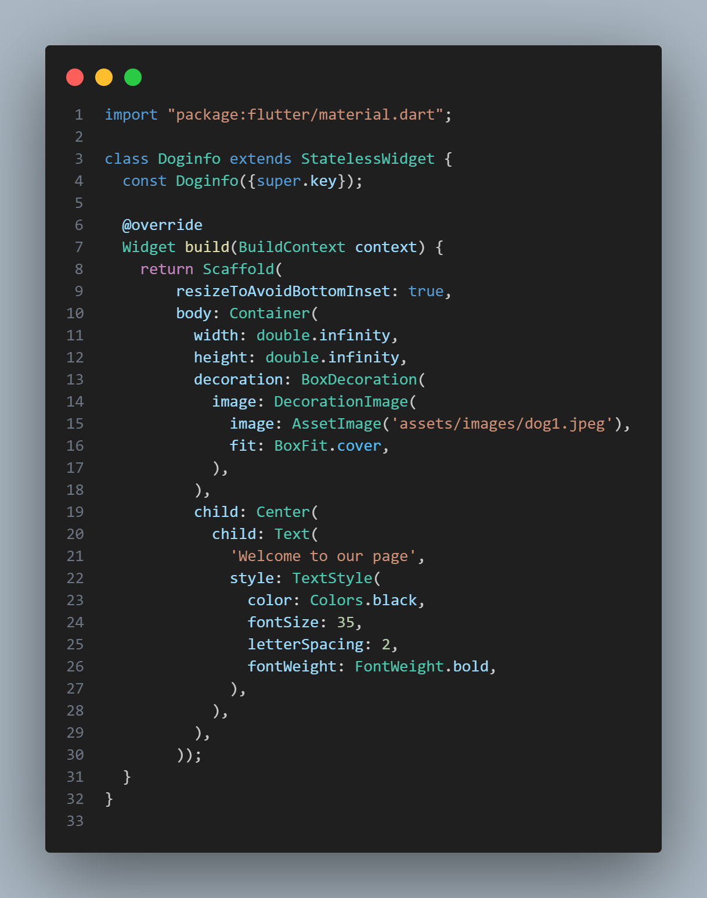

## Slidder-2
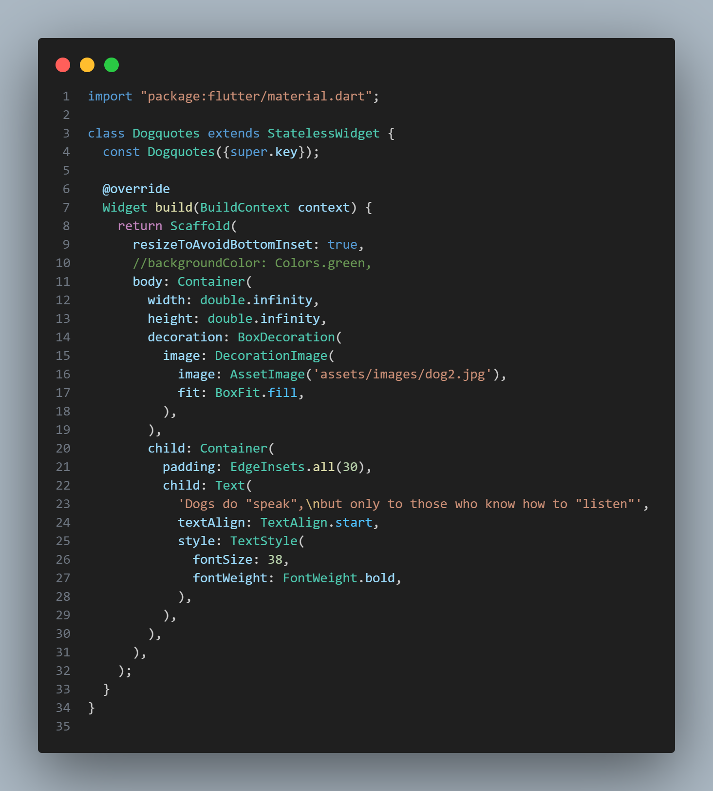

## Slidder-3
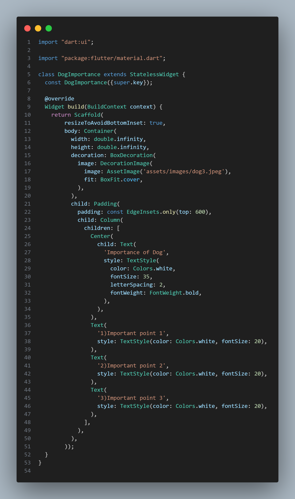

## Slidder-4
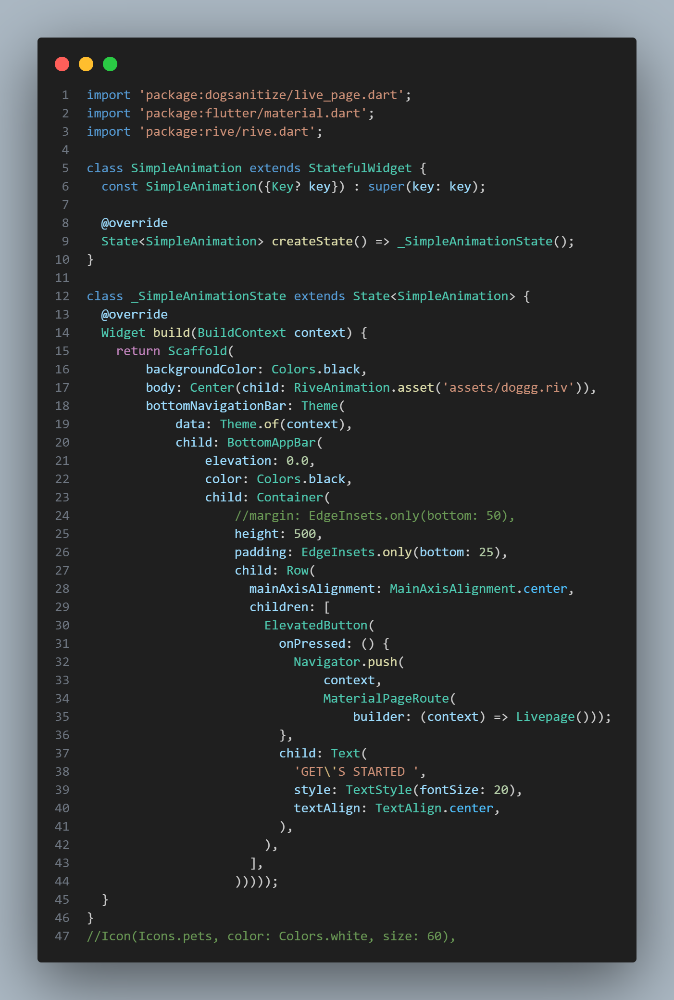

## Livepage
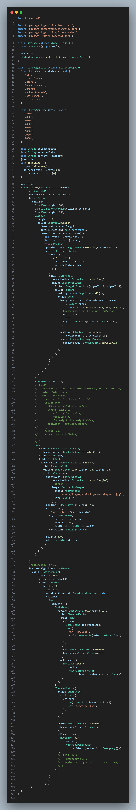

## SanitizeForm
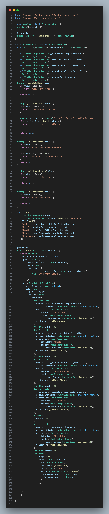

## LiveLocation
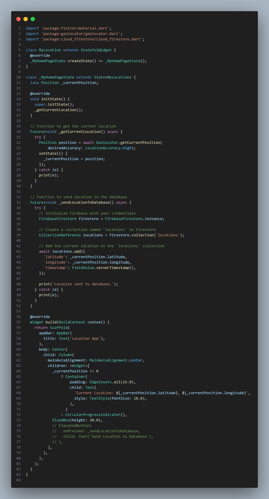

# TechnologyUsed

### ->Flutter
### ->Dart
### ->Firebase
### ->GoogleMaps
### ->Rive
### ->Material UI

------------------------------------------------------------------
# Dependencies
------------------------------------------------------------------
## List of Dependencies

### ->flutter:
     sdk: flutter

  #### cupertino_icons: ^1.0.2
   #### firebase_core: ^2.4.1
   #### cloud_firestore: ^4.3.2
   #### smooth_page_indicator: ^1.1.0
   #### geolocator: ^10.1.0
   #### google_maps_flutter_web: ^0.5.4+3
   #### google_maps_flutter: ^2.5.3
---------------------------------------------------------------------------
# ApiUsed

### ->Firebase Api
### ->Googlemap Api
---------------------------------------------------------------------------
# Contributing

### ->Encourage others to contribute to the project
-------------------------------------------------------------------------
# License
--------------------------------------------------------------------------
### ->Free app developed version 1.0.0
--------------------------------------------------------------------------
# Screenshots 
---------------------------------------------------------------------------
## Slidder1
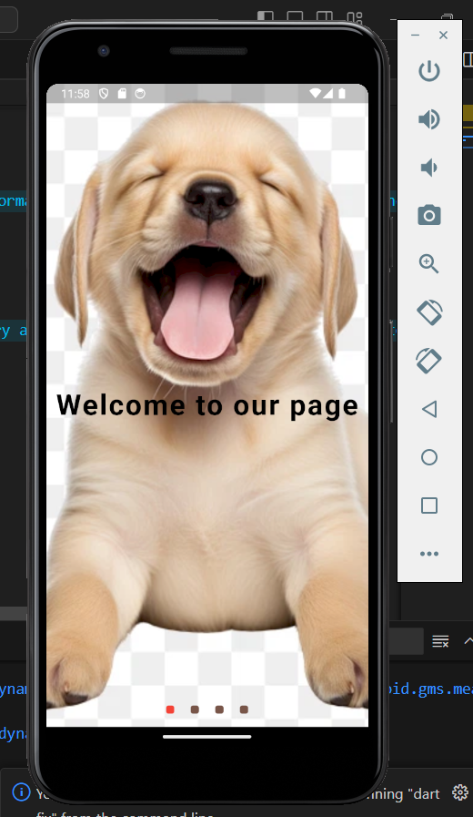

## Slidder2
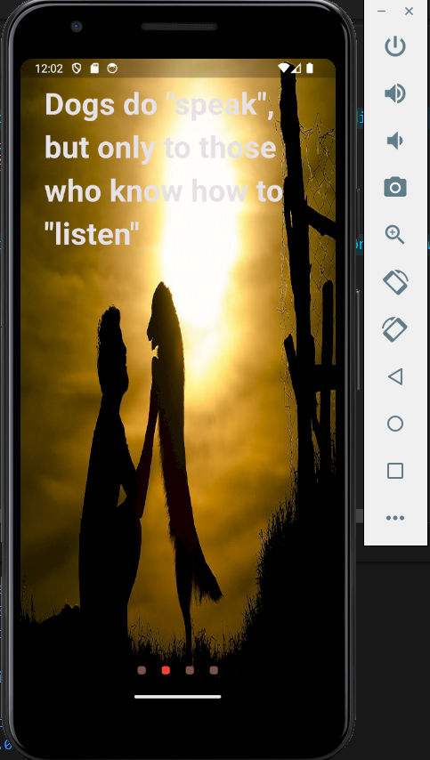

## Slidder3
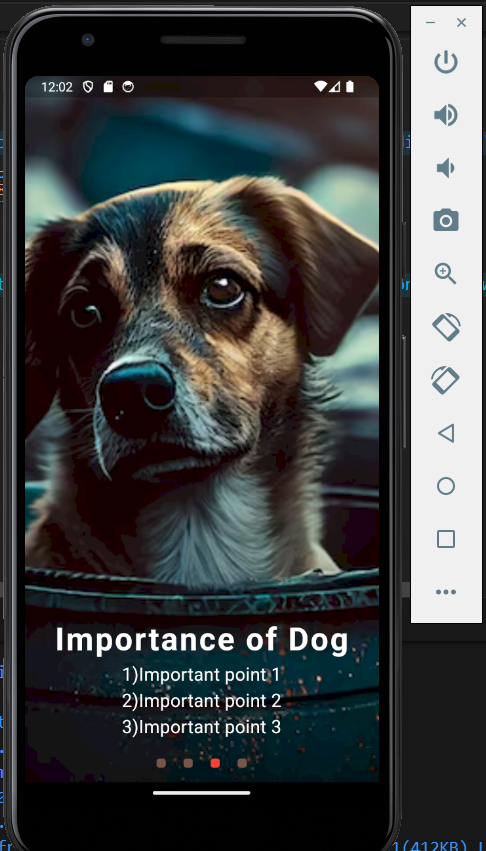

## Slidder4

## slidder5
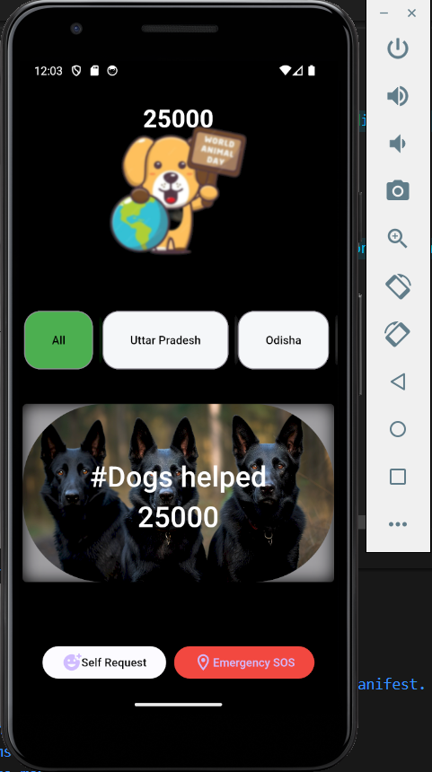

## slidder6
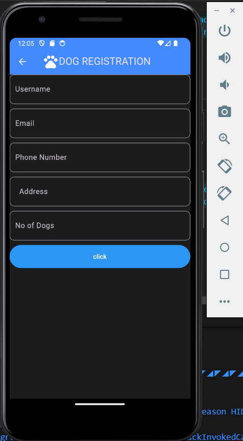

## slidder7
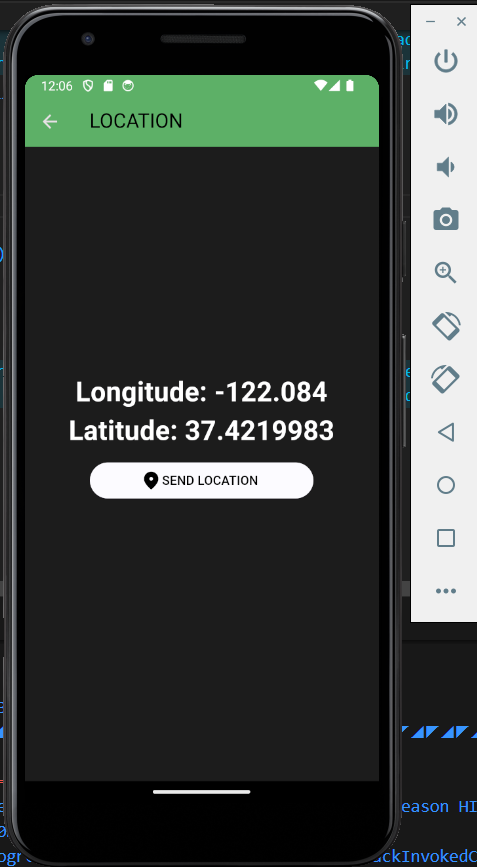

